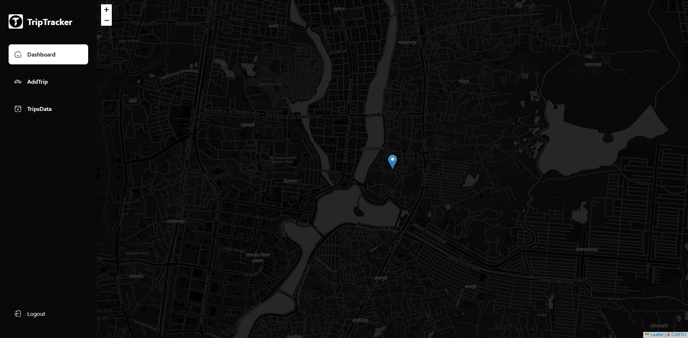
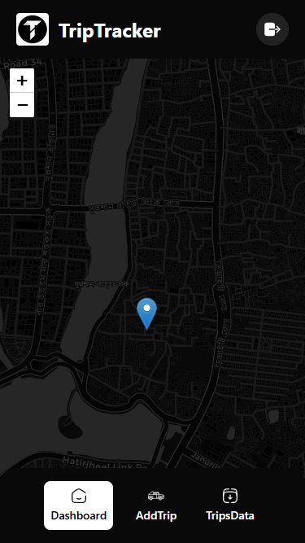
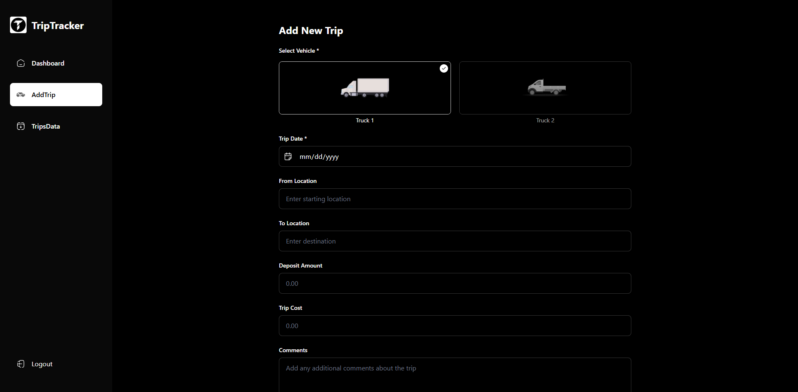
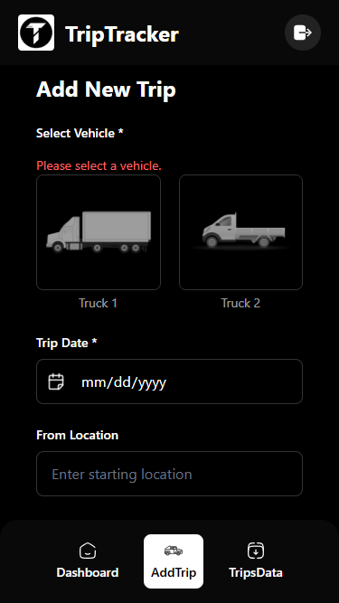
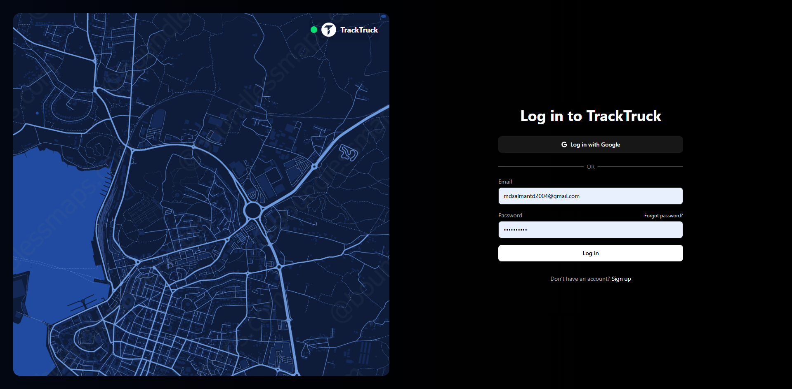
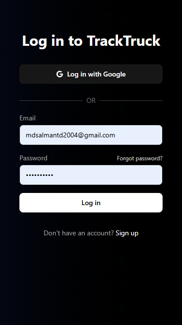

# Trip Tracking System 🚗📍

A full-stack web application designed for tracking live vehicle locations, managing trips, and analyzing fleet data. The project features interactive maps, a responsive dashboard, and a robust backend API for managing drivers, user authentication, and trip statuses.

## 🚀 Tech Stack

### Frontend
- **Framework:** React 19 + Vite
- **Styling:** Tailwind CSS v4
- **Maps:** Leaflet & React-Leaflet
- **Icons & UI:** Lucide React, React Icons
- **Forms:** React Hook Form
- **Routing:** React Router v7

### Backend
- **Runtime:** Node.js
- **Framework:** Express.js
- **Database:** MySQL (using `mysql2`)
- **Authentication:** JSON Web Tokens (JWT) & bcrypt
- **Mailer:** Nodemailer

---

## 📸 Screenshots

Here is a glimpse of the application across different devices:

### Dashboard
| Desktop | Mobile |
| :---: | :---: |
|  |  |

### Add Trip
| Desktop | Mobile |
| :---: | :---: |
|  |  |

### Login
| Desktop | Mobile |
| :---: | :---: |
|  |  |

---

## 📁 Folder Structure

```
├── backend/
│   ├── config/          # Database connection setups
│   ├── controllers/     # Route logic for users, trips, locations
│   ├── database/        # DB schema definition and migrations
│   ├── middlewares/     # Route protection (e.g., isAdmin, isLoggedIn)
│   ├── routes/          # Express API route definitions
│   ├── utils/           # Helper scripts (Token generation, Mailers)
│   └── server.js        # Backend entry point
│
└── frontend/
    ├── public/images/   # Static assets and screenshots
    ├── src/
    │   ├── _auth/       # Authentication pages (Login, Register, Reset Password)
    │   ├── _root/       # Main app layout (Dashboard, Add/Edit Trips)
    │   ├── api/         # Axios configuration and API wrappers
    │   ├── components/  # Reusable UI components (LiveMap, Sidebar)
    │   ├── context/     # Global state (AuthContext)
    │   └── pages/       # Landing and supplementary pages
    └── vite.config.js   # Frontend bundler config
```

---

## ⚙️ Installation & Setup

Before you begin, ensure you have **Node.js** and **MySQL** installed.

### 1. Database Setup
1. Create a MySQL database for the project.
2. Execute the schema definitions found under `backend/database/schema.sql` to construct the tables.
3. Run the migrations in `backend/database/migrations/` sequentially if applicable.

### 2. Backend Setup
```bash
# Navigate to the backend directory
cd backend

# Install dependencies
npm install

# Setup environment variables
# Copy .env.example to .env and configure your variables
cp .env.example .env

# Start the development server
npm run dev
```

### 3. Frontend Setup
```bash
# Navigate to the frontend directory
cd frontend

# Install dependencies
npm install

# Setup environment variables (if needed)
# Copy .env.example to .env
cp .env.example .env

# Start the Vite development server
npm run dev
```

The frontend will generally run at `http://localhost:5173/` and coordinate with the backend.

---

## 🔐 Key Features
- **Live Location Tracking**: View driver locations in real-time leveraging interactive Leaflet maps.
- **Trip Management**: Add, edit, and keep track of all ongoing and past vehicle trips.
- **Role-based Authentication**: Secure access controls featuring protected routes.
- **Responsive UI**: Fully mobile-optimized user interfaces.
